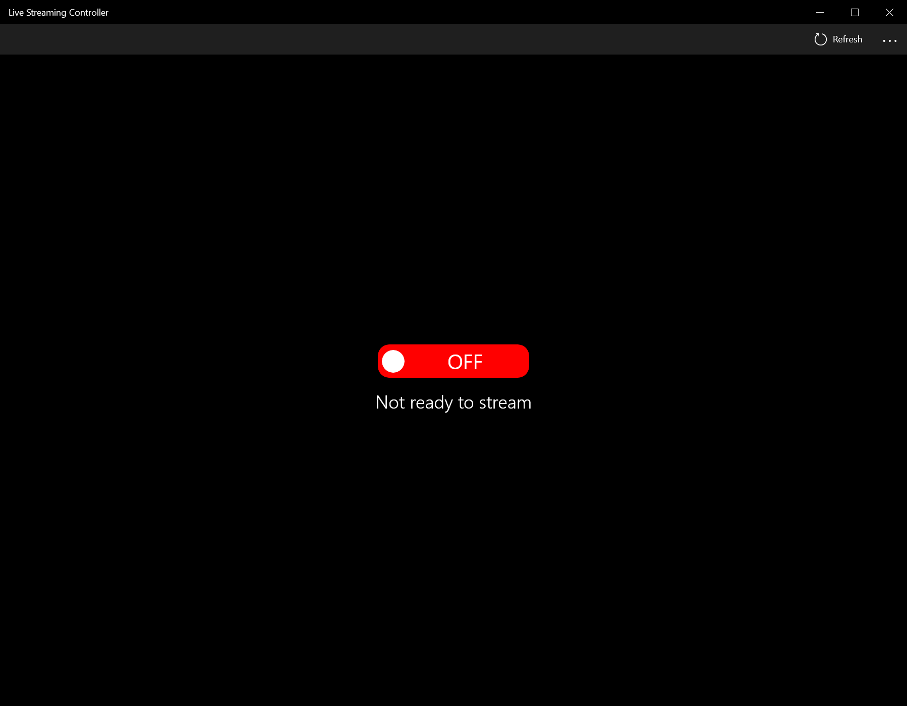
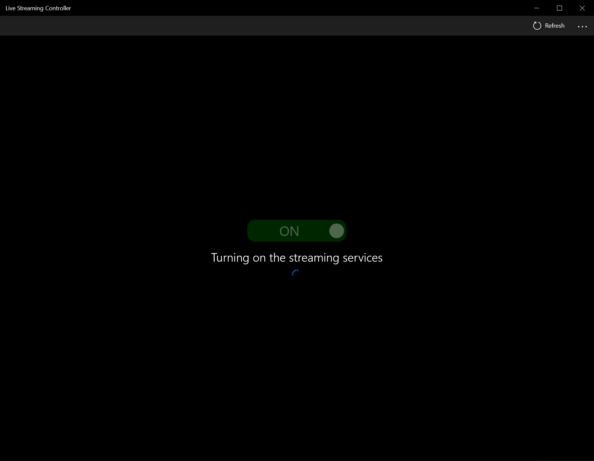
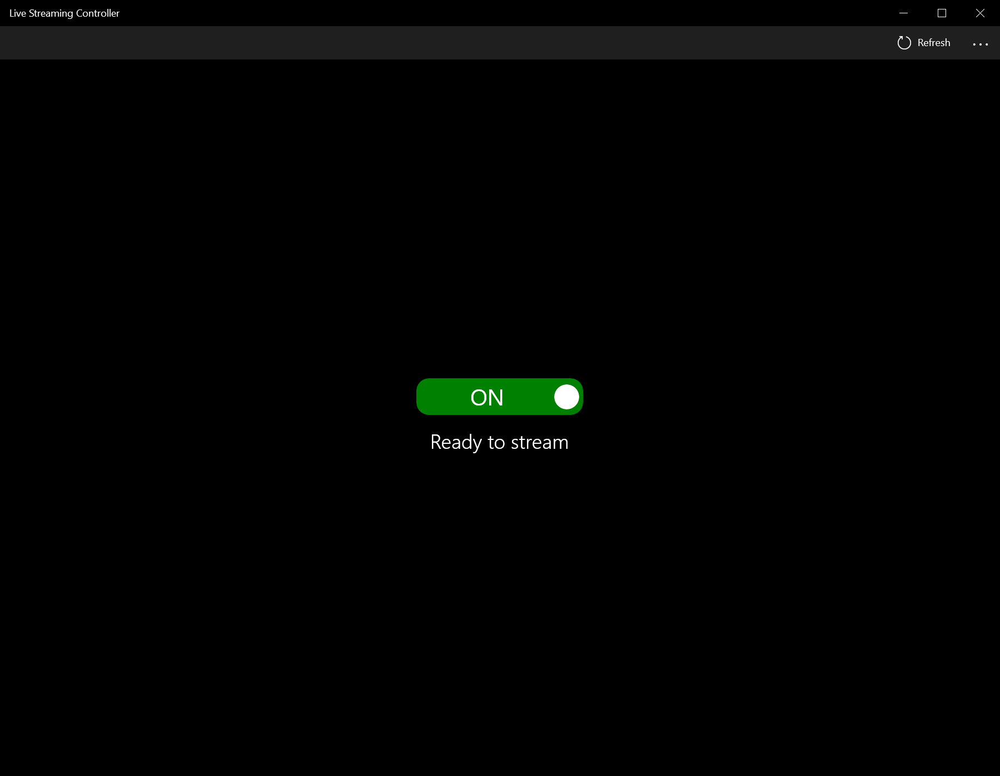
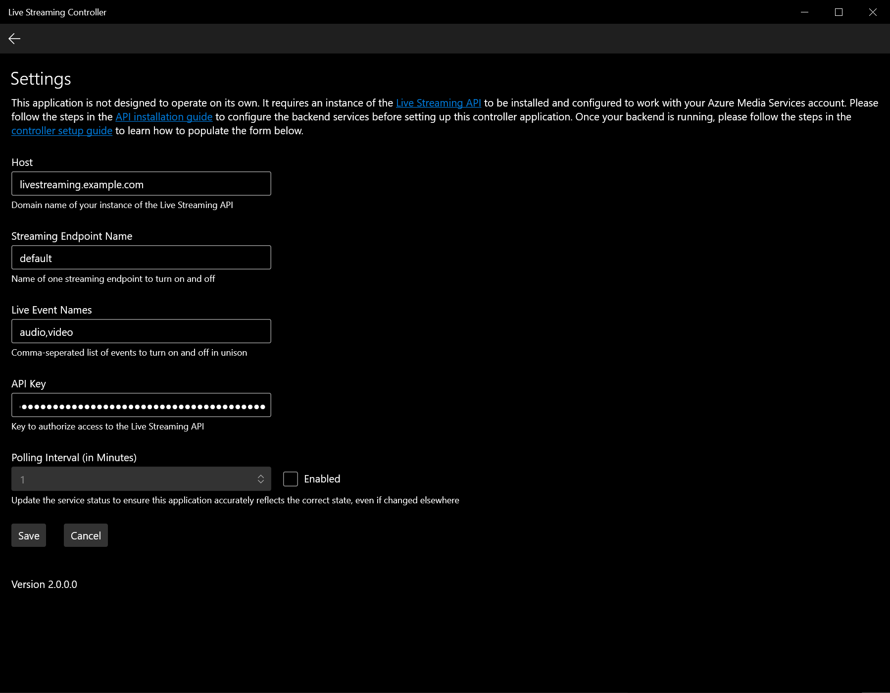

<div align="center">

<br>

<h1>Live Streaming Controller<br/><sub>Switch on and off one or more live streaming events</sub></h1>

[:one: API](https://github.com/literal-life-church/live-streaming-api/) |
<strong>[:two: Controller](https://github.com/literal-life-church/live-streaming-controller/)</strong> |
[:three: Player](https://github.com/literal-life-church/stream-switch/)

```text
"Streamlining the process to get your events online."
```

[](https://dev.azure.com/literal-life-church/live-streaming-controller/_build/latest?definitionId=2&branchName=develop)
[](https://codeclimate.com/github/literal-life-church/live-streaming-controller)
[](https://www.codacy.com/gh/literal-life-church/live-streaming-controller)
[](https://github.com/literal-life-church/live-streaming-controller/releases)

<a href="https://www.microsoft.com/en-us/p/live-streaming-controller/9pdq8rbbgd9z"></a>

<hr />
</div>

## Project Introduction

The Live Streaming Controller is a subset of a three-part application designed to view a stream of one or more live events on [Azure Media Services](https://azure.microsoft.com/en-us/services/media-services/). These parts are:

1.  **[Live Streaming API](https://github.com/literal-life-church/live-streaming-api/):** Turn on or off one more live events on Azure Media Services
2.  **[Live Streaming Controller](https://github.com/literal-life-church/live-streaming-controller):** A simple tool for the event broadcaster to interface with the Live Streaming API
3.  **[Stream Switch](https://github.com/literal-life-church/stream-switch):** A front-end, viewer application for viewing one or more live streams on a website

In production, an event broadcaster would use the Live Streaming Controller as a front-end application to make a `POST` call to the `/broadcaster` endpoint, a `DELETE` call to the `/broadcaster`, and a `GET` call to the `/broadcaster` endpoint on the Live Streaming API to respectively start the streaming services at the beginning of an event, stop the services at the end, and read the status of these resources at any point before, during, or after. All of these calls are authenticated, since they can reveal sensitive information about the state of your resources, or result in a state change, and thus a billing change, on the broadcaster's Azure account.

A viewer would then go to a website which has the Stream Switch installed to view the event. That application calls the `/locators` endpoint to fetch the streaming URLs from Azure to play inside of an HTML5 video player on the web. Since this endpoint intended for public consumption, it is the only endpoint in the API which is not authenticated.

This portion of the application trio focuses on turning on and off the live streaming services on Azure. All of the technical complexity of the service orchestration and ordering is abstracted behind a simple toggle button. Simply press the switch to turn it and all of the necessary services on in Azure, and press the switch again to turn them all off. This simplistic approach empowers a non-technical live event broadcaster to quickly get one or more of their live events online within seconds.

---

<div align="center">

</div>

## Setup

Please note that the Live Streaming Controller is not a standalone application. It requires an instance of the [Live Streaming API](https://github.com/literal-life-church/live-streaming-api/) to be installed on Azure Functions to directly control the services, and that the [Stream Switch](https://github.com/literal-life-church/stream-switch) is installed on a website so that viewers may watch a live event. Please follow the directions at each of the above links prior to continuing.

### Generate an API Key

Since this application controls sensitive pieces of information about your live events on Azure, it is required that you have an access key to indicate that you are authorized to make these kinds of changes to your Azure account.

1.  Go to the [Azure Portal](https://portal.azure.com/)
2.  Go to the [Azure Function Apps](https://portal.azure.com/#blade/HubsExtension/BrowseResource/resourceType/Microsoft.Web%2Fsites/kind/functionapp)
3.  Open up the application which has an installation of the Live Streaming API
4.  Click on the App Keys tab
5.  Click on the New Host Key button
6.  Give this key a name, such as `Live Streaming Controller`, and click OK
7.  Copy the value of this key to your clipboard. You'll need this value when setting up the Live Streaming Controller.

### Configure the Local Application

Once the other applications are set up, you may install this application.

1.  Download and install this app from the [Microsoft Store](https://www.microsoft.com/en-us/p/live-streaming-controller/9pdq8rbbgd9z)
2.  Open up the application
3.  Click on the three dots at the top-right of the window, then go to Settings
4.  Enter the name of the domain where the Live Streaming API is hosted, such as `livestreamingapi.mychurch.com`. If you installed the API on Azure function and did not use a custom domain, the domain name will look like `XXXXXX.azurewebsites.net`.
5.  Enter the Streaming Endpoint name, as shown in the [Azure Portal](https://portal.azure.com/). The Streaming Endpoint name is available under the Streaming Endpoints tab in the [Media Service](https://portal.azure.com/#blade/HubsExtension/BrowseResource/resourceType/microsoft.media%2Fmediaservices) resource you created on Azure.
6.  Enter the Live Event names, as shown in the [Azure Portal](https://portal.azure.com/). If you have more than one live event to turn on and off in unison, simply seperate each name with a comma, such as `audio,video`. The Live Event names are avaialble under the Live Streaming &gt; Live Events tab in the [Media Service](https://portal.azure.com/#blade/HubsExtension/BrowseResource/resourceType/microsoft.media%2Fmediaservices) resource you created on Azure.
7.  Enter the API Key you created in the Azure Portal into this field
8.  The Polling Interval is optional. Check the Enabled checkbox and enter a positive number in the number field to configure how often the controller checks for status changes, in case another event broadcaster makes changes to the streaming services.
9.  Save the form

## Screenshots

In addition to the listing on the [Microsoft Store](https://www.microsoft.com/en-us/p/live-streaming-controller/9pdq8rbbgd9z), here are a few screenshots of the application at work.

<div align="center">
<a href="./.docs/screenshots/off.png"></a>
<a href="./.docs/screenshots/turning-on.png"></a>
<a href="./.docs/screenshots/on.png"></a>
<a href="./.docs/screenshots/settings.png"></a>
</div>

<br><br>

---

<div align="center">
<br/><br/>

<br/>
<sub><i>This application was inspired by a need for the live streaming pipeline we use at <a href="https://www.literallife.church/" target="_blank">Literal Life Church</a></i></sub>
<br><br>

Contributors:<br><br>

[](https://sourcerer.io/fame/oliverspryn/literal-life-church/live-streaming-controller/links/0)
[](https://sourcerer.io/fame/oliverspryn/literal-life-church/live-streaming-controller/links/1)
[](https://sourcerer.io/fame/oliverspryn/literal-life-church/live-streaming-controller/links/2)
[](https://sourcerer.io/fame/oliverspryn/literal-life-church/live-streaming-controller/links/3)
[](https://sourcerer.io/fame/oliverspryn/literal-life-church/live-streaming-controller/links/4)
[](https://sourcerer.io/fame/oliverspryn/literal-life-church/live-streaming-controller/links/5)
[](https://sourcerer.io/fame/oliverspryn/literal-life-church/live-streaming-controller/links/6)
[](https://sourcerer.io/fame/oliverspryn/literal-life-church/live-streaming-controller/links/7)

<br/>


<br/>
<br/>


</div>